#### 3. **DEVELOPER_GUIDE.md** - Extension & Customization
# Developer Guide

## Adding New Channels
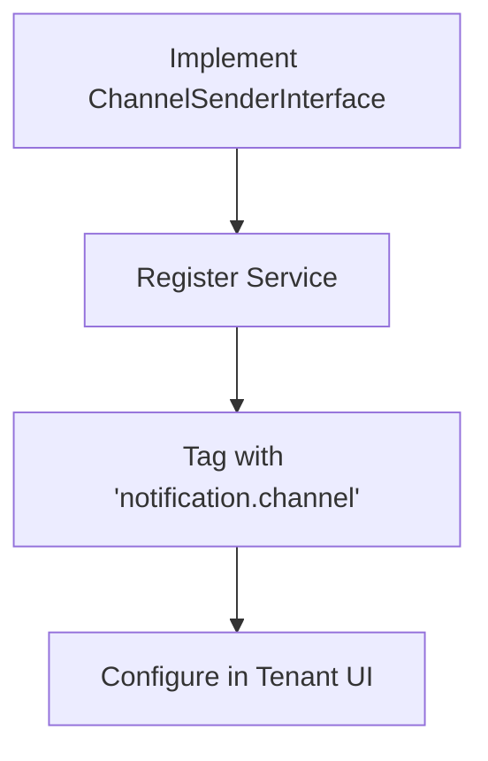

Testing Sequence
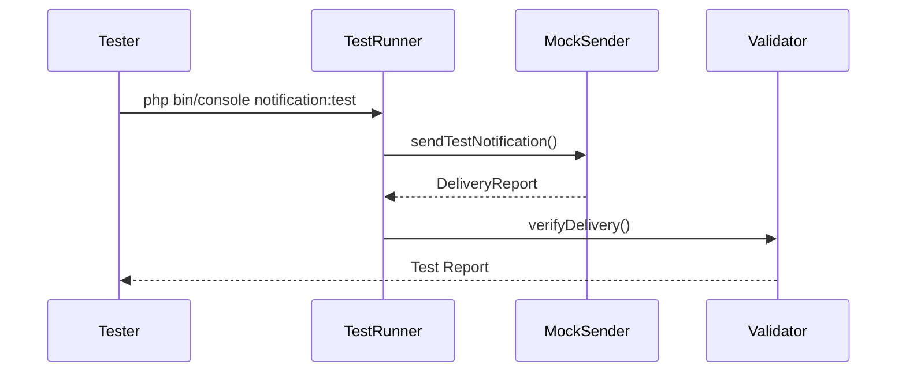

Debugging Flow

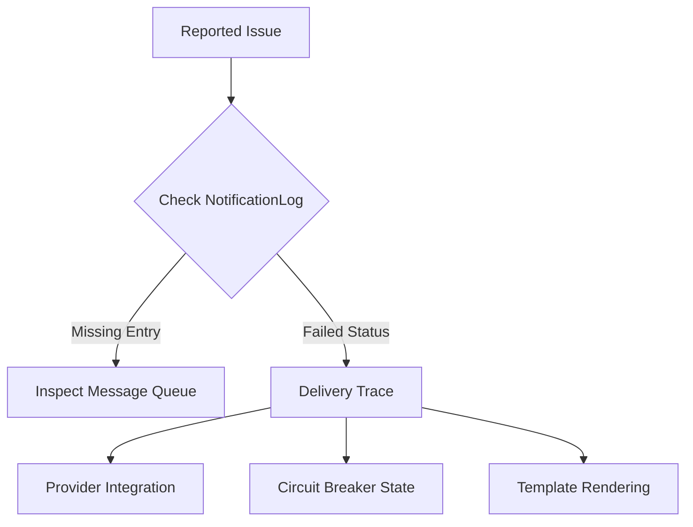

Performance Optimization
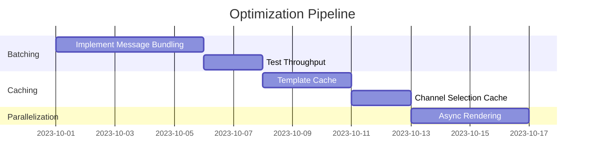

Monitoring Points
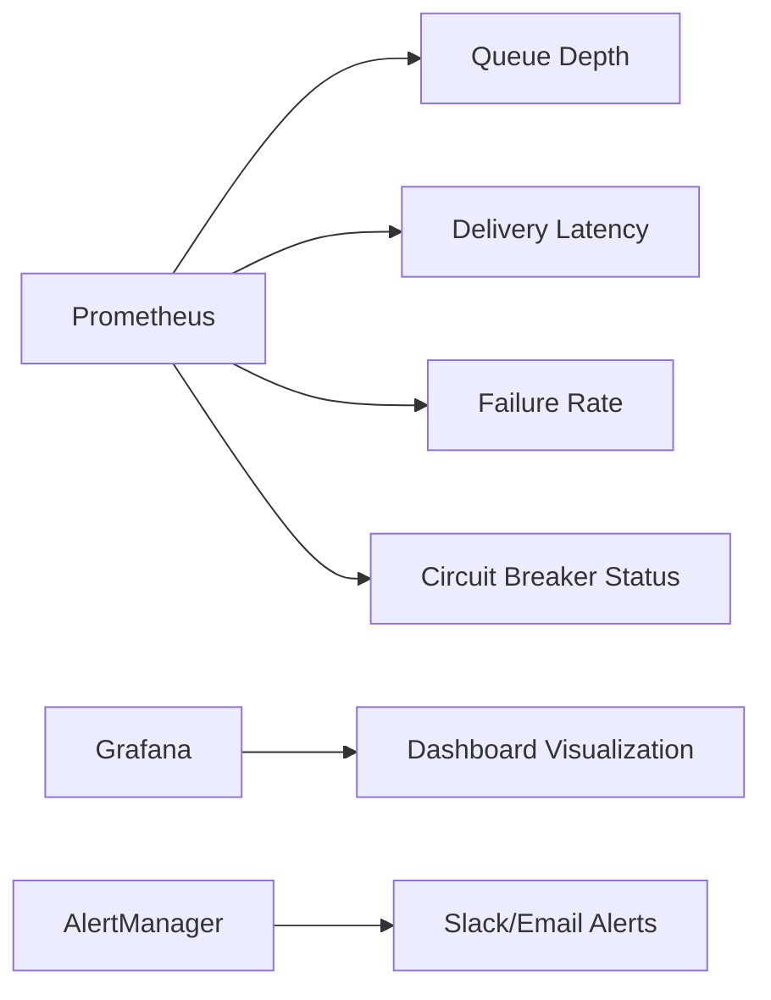

#### 4. **DECISIONS.md** - Architectural Choices
# Architectural Decisions

## Core Design Principles
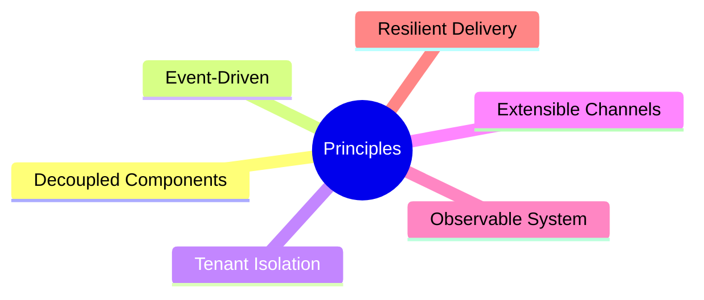

Tradeoff Analysis

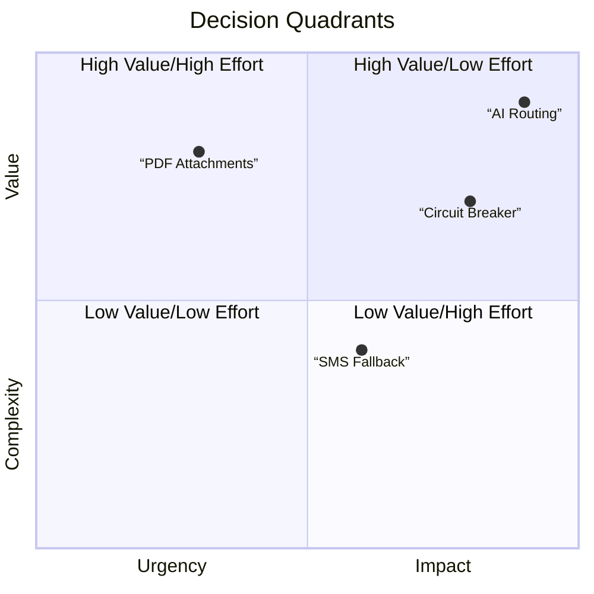

Evolution Timeline    

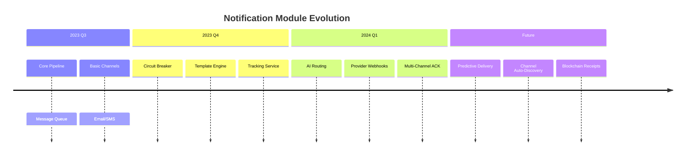

Dependency Map

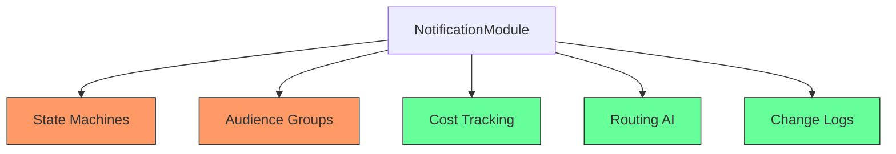

Risk Mitigation

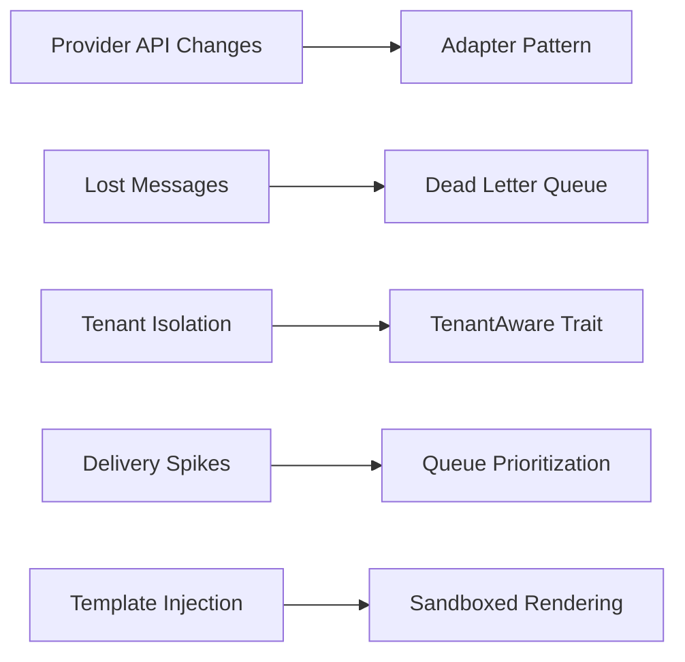

### How to Use:
1. Create these files in your `src/NotificationModule/docs/` directory:
   - `README.md`
   - `ADVANCED.md`
   - `DEVELOPER_GUIDE.md`
   - `DECISIONS.md`

2. Commit with message: "Add comprehensive module documentation"

3. View rendered diagrams on:
   - GitHub/GitLab: Native Mermaid support
   - VS Code: With Mermaid Preview extension
   - Local: Use `mermaid-cli` to generate images

### Benefits:
- **Living Documentation**: Diagrams stay current with code changes
- **Onboarding**: New developers understand flows in minutes
- **Decision Tracking**: Record architectural choices
- **Troubleshooting**: Visual debugging guides
- **Extension Guide**: Clear path for adding new features

Would you like me to generate documentation for other modules using this same pattern?

## Core Notification Flow

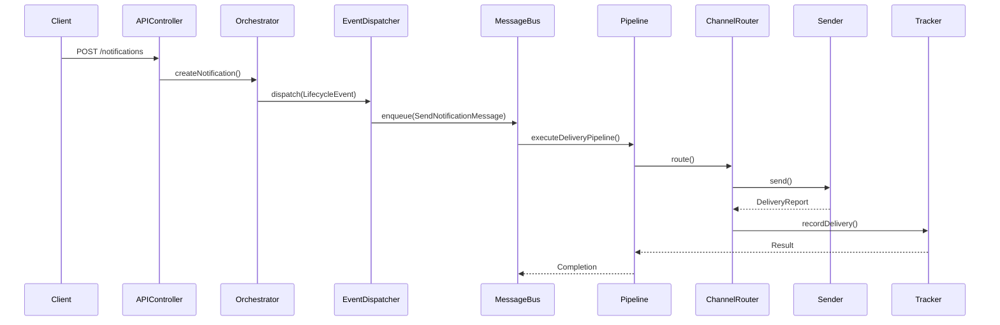

Failure Recovery Mechanism
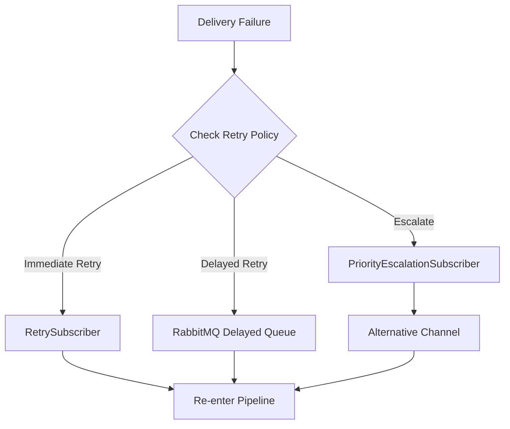

Component Interactions
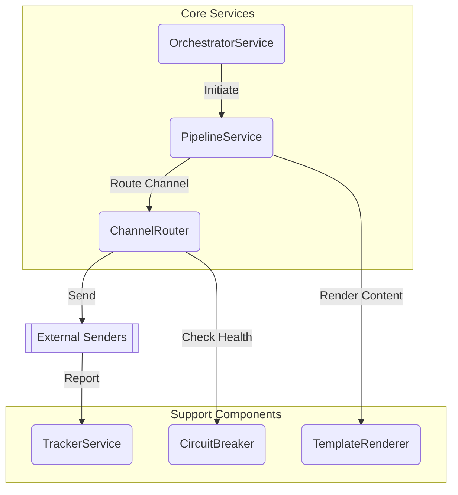

Multi-Tenant Isolation
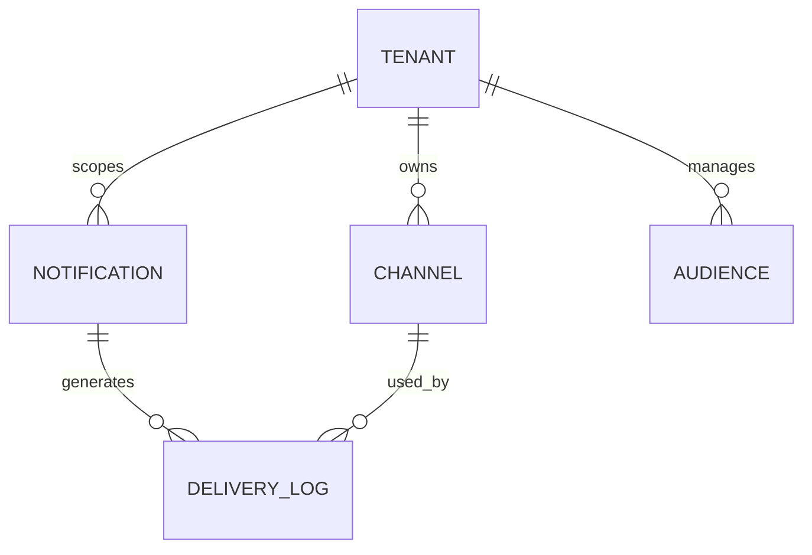
