Autocondat® Notification Module Architecture
================================

> **Version 1.0 – 2025**  
> Enterprise-grade, multi-tenant notification engine for the Autocondat® SaaS platform  
> Copyright © 2025 Enrique Pascalin <erparom@gmail.com>
> This source code is protected under international copyright law.
> All rights reserved. No warranty, explicit or implicit, provided.
> Unauthorized copying of this file, via any medium is strictly prohibited.
> This file is confidential and only available to authorized individuals with the
> permission of the copyright holders.  If you encounter this file and do not have
> permission, please contact the copyright holders and delete this file.
> 
> **author** Enrique Pascalin, Erparom Technologies
> 
> **version** 1.0.0
> 
> **since** 2025-06-01
> 
> **license** license.md

Table of Contents
-----------------
I.  [Introduction](#i-introduction)

II.  [Core Architecture](#ii-core-architecture)
   
&nbsp;&nbsp;&nbsp;&nbsp;II.1 [High-Level System Flow](#ii1-high-level-system-flow)
   
&nbsp;&nbsp;&nbsp;&nbsp;II.2 [Component Breakdown](#ii2-component-breakdown)

&nbsp;&nbsp;&nbsp;&nbsp;II.3 [Orchestration Layer](#ii3-orchestration-layer)

&nbsp;&nbsp;&nbsp;&nbsp;II.4 [Processing Services](#ii4-processing-services)

III. [Processing Pipeline](#iii-processing-pipeline)

&nbsp;&nbsp;&nbsp;&nbsp;III.1 [Sequence Flow](#iii-1-sequence-flow)

&nbsp;&nbsp;&nbsp;&nbsp;III.2 [Key Services](#iii-2-key-services)

IV. [Workflow Types](#iv-workflow-types)

&nbsp;&nbsp;&nbsp;&nbsp;IV.1 [Immediate Notifications](#iv-1-immediate-notifications)

&nbsp;&nbsp;&nbsp;&nbsp;IV.2 [Scheduled Notifications](#iv-2-scheduled-notifications)

&nbsp;&nbsp;&nbsp;&nbsp;IV.3 [Event-Triggered Notifications](#iv-3-event-triggered-notifications)

&nbsp;&nbsp;&nbsp;&nbsp;IV.4 [Notification Acknowledgment](#iv-4-notification-acknowledgement)

V. [Multi-Tenant Implementation](#v-multi-tenant-implementation)

&nbsp;&nbsp;&nbsp;&nbsp;V.1 [Data Isolation Model](#v-1-isolation-model)

&nbsp;&nbsp;&nbsp;&nbsp;V.2 [Isolation Mechanisms](#v-2-isolation-mechanisms)

VI. [Key Features](#vi-key-features)

&nbsp;&nbsp;&nbsp;&nbsp;VI.1 [Dynamic Channel Failover](#vi-1-dynamic-channel)

&nbsp;&nbsp;&nbsp;&nbsp;VI.2 [Delivery Optimization](#vi-2-delivery-optimization)

&nbsp;&nbsp;&nbsp;&nbsp;VI.3 [Security Protocols](#vi-3-security-protocols)

VII.  [Error Handling & Recovery](#vii-error-handling--recovery)

&nbsp;&nbsp;&nbsp;&nbsp;VII.1 [Circuit Breaker Pattern](#vii-1-circuit-breaker)

&nbsp;&nbsp;&nbsp;&nbsp;VII.2 [Retry Mechanism](#vii-2-retry-mechanism)

&nbsp;&nbsp;&nbsp;&nbsp;VII.3 [Reconciliation System](#vii-3-reconciliation-system)

&nbsp;&nbsp;&nbsp;&nbsp;VII.4 [Alerting Integration](#vii-4-alerting-integration)

VIII.  [Security Model](#viii-security-model)

&nbsp;&nbsp;&nbsp;&nbsp;VIII.1 [Data Protection](#viii-2-data-protection)

&nbsp;&nbsp;&nbsp;&nbsp;VIII.2 [Acess Controls](#viii-2-access-controls)

IX.  [Monitoring & Observability](#ix-monitoring--observability)

&nbsp;&nbsp;&nbsp;&nbsp;IX.1 [Tracking Dashboard](#ix-1-tracking-dashboard)

&nbsp;&nbsp;&nbsp;&nbsp;IX.2 [Key Metrics](#ix-2-key-metrics)

&nbsp;&nbsp;&nbsp;&nbsp;IX.3 [Logger](#ix-3-logger)

&nbsp;&nbsp;&nbsp;&nbsp;IX.4 [Observability Framework](#ix-4-observability-framework)

X. [Integration Points](#x-integration-points)

&nbsp;&nbsp;&nbsp;&nbsp;X.1 [Internal Modules](#x-1-internal-modules)

&nbsp;&nbsp;&nbsp;&nbsp;X.2 [External Systems](#x-2-external-systems)

XI.  [Integration Guide](#xi-integration-guide)

XII.  [Extension & Customisation](#xii-extension--customisation)

XIII.  [Architectural Decisions](#xiii-architectural-decisions)

XIX.  [Appendix](#xix-appendix)

* * *
* * *

I. Introduction
---------------

The Notification Module provides enterprise-grade notification capabilities for Autocondat's SaaS platform. It handles the entire notification lifecycle - from creation and templating to intelligent routing, delivery, and tracking. Built on Symfony's event-driven architecture, it supports:  
- Multi-channel delivery (email/SMS/push/webhook)  
- Circuit breaker patterns for fault tolerance  
- Full audit trails with delivery status tracking  
- Tenant isolation for data security  
- AI-driven routing optimization  

The module serves all seven industry applications with customizable workflows while maintaining strict compliance with enterprise security standards.

The **Notification Module** provides enterprise-grade notification capabilities for Autocondat's SaaS platform. It handles the entire notification lifecycle (*creation* → *templating* → *routing* → *delivery* → *tracking*). Key features include:

*   **Multi-channel delivery** (email/SMS/push/webhook)
    
*   **Lifecycle management** Creation → Routing → Delivery → Tracking  

*   **Circuit breaker** patterns for fault tolerance
    
*   Full **audit trails** with delivery status tracking
    
*   Strict **tenant isolation** via `TenantAwareInterface` and Doctrine filters

*   **AI-driven** routing optimization with circuit-breaker health checks
    
*   **Full compliance**: GDPR retention policies, audit trails, RBAC controls

*   Support for any Autocondat® implementation

#### API Based Notifications

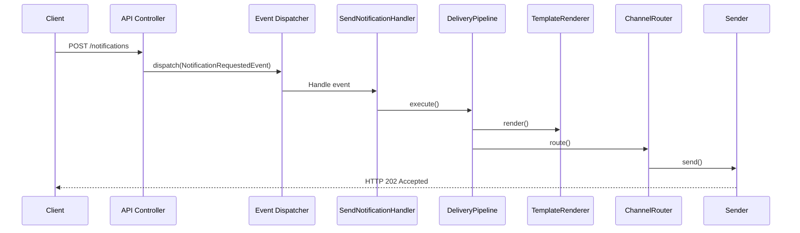

#### Event Driven Notifications

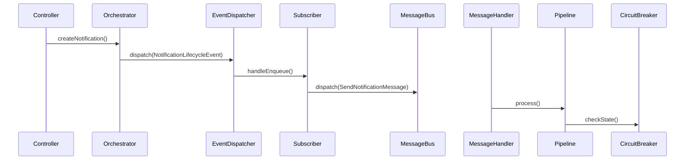

### User / Module Driven Notifications

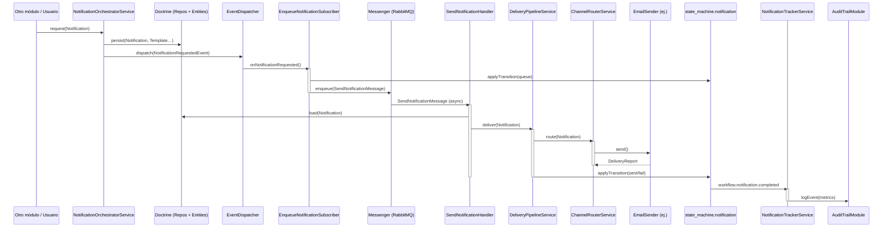


#### Production Deployment Architecture

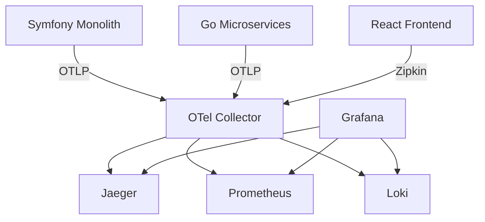

#### Key Model Relationships

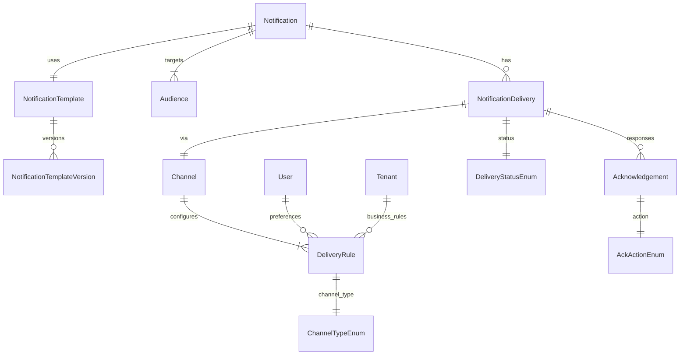

#### High Level Architecture

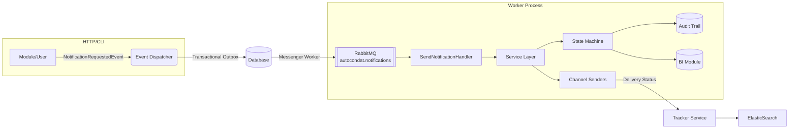

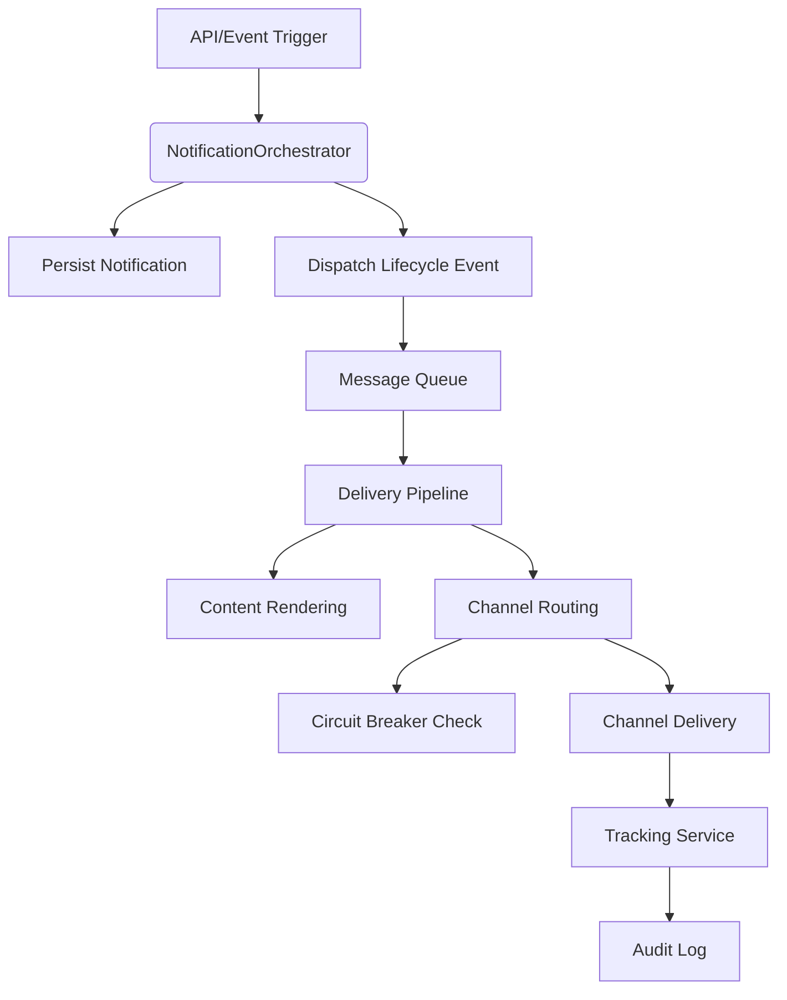

## Overview
The Notification Module provides enterprise-grade notification capabilities for Autocondat's SaaS platform. It handles the entire notification lifecycle - from creation and templating to intelligent routing, delivery, and tracking. Built on Symfony's event-driven architecture, it supports multi-channel delivery (email/SMS/push), circuit breaker patterns, and full auditability.

---

## Core Architecture


Key Components
1. Orchestration Layer

    NotificationOrchestratorService: Central coordinator for notification processing

    NotificationLifecycleEvent: Event dispatched at critical lifecycle stages

    EnqueueNotificationSubscriber: Converts events to queued messages

2. Processing Pipeline

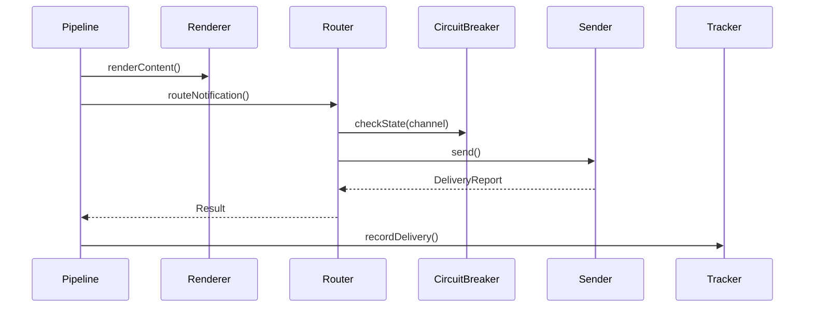

    3. Channel Management

    ChannelRouterService: AI-driven optimal channel selection

    NotificationCircuitBreaker: Monitors channel health

    ChannelSenderInterface: Contract for channel implementations

4. Tracking & Audit

    NotificationTrackerService: Real-time delivery monitoring

    DeliveryReport: Standardized status container

    NotificationLog: Entity for permanent audit records


Workflow Types
1. Immediate Notifications

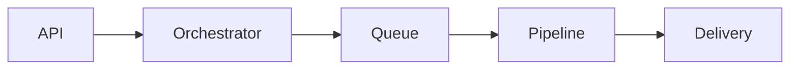

2. Scheduled Notifications

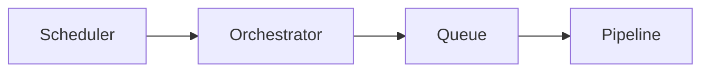

3. Event-Triggered

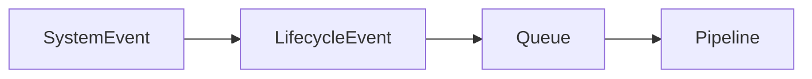


Multi-Tenant Implementation

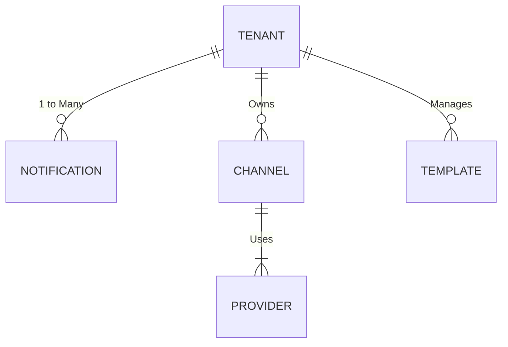

Key Features

    Dynamic channel failover

    Template personalization with Twig

    Delivery priority queues

    Real-time delivery tracking

    Circuit breaker pattern

    Multi-tenant isolation


***
 
---
## II. Core Architecture

Core Architecture of the Notification module


---
### II.1 High-Level System Flow

The notification processing follows a strict pipeline architecture:  


The notification processing follows a strict 5-phase architecture:

1.  **Trigger Phase**
           
2.  **Orchestration Phase**
            
3.  **Processing Phase**
        
4.  **Delivery Phase**
        
5.  **Audit Phase**

---
### II.2 Component Breakdown

#### Trigger Phase

Requests originate from API calls, scheduled jobs, or system events and supports immediate, scheduled, and event-triggered notifications:

*   API endpoints: `POST /notifications`   

*   Scheduled jobs: Symfony Commands / cron jobs

*   Domain events: Emitted by other Autocondat modules
    
#### Orchestration Phase

`NotificationOrchestratorService` validates payloads and resolves audiences. Persists notification entities and dispatches lifecycle events.

*   Payload validation & audience resolution
    
*   Tenant context injection
    
*   DLifecycle event dispatching (dispatches `NotificationLifecycleEvent`)
    
#### Processing Phase

Asynchronous workers render content via Twig templates. It applies business rules and delivery constraints; AI-driven channel selection with failover mechanisms.

*   Template rendering with XSS sanitisation and dynamic variables
    
*   AI driven channel selection & cost optimisation
    
*   Circuit breaker health guard

#### Delivery Phase
    
*   Transmits through channel-specific adapters (Email/SMS/Push)
        
*   Implements circuit breaker patterns for fault tolerance
        
#### Audit Phase
    
*   Immutable tracking of delivery status and costs
        
*   Generates reconciliation reports

---
### II.3 Orchestration Layer

#### **NotificationOrchestratorService**

1.  Validate payload integrity
    
2.  Resolve audience segments via CRM integration
    
3.  Apply tenant-specific delivery rules
    
4.  Initiate tracking workflows

---
### II.4 Processing Services

* TemplateRendererService: Renders multi-channel content using Twig with dynamic variable support. Implements output sanitization and Redis caching.

* ChannelRouterService: AI-driven channel selection based on:

    * User preferences (35% weight)

    * Channel health status (25%)

    * Message urgency (20%)

    * Cost constraints (15%)

    * Regulatory compliance (5%)

* NotificationCircuitBreaker: State machine monitoring channel health:

    * Closed → Open after 5 failures/5min

    * Open → HalfOpen after 10min cooling period

    * HalfOpen → Closed on successful trial

* * *

---
III. Component Architecture
---------------------------

Component architecture??

---
### III.1 Orchestration Layer

*   **Notification Orchestrator Service**:
    
    - Central coordinator handling payload validation and integrity
        
    - Audience resolution and pipeline initiation
        
    - Enforces tenant-specific delivery rules
        
    - Initiate tracking workflows

    - Permission checks and security validation
        
*   **Notification Lifecycle Event**:
    
    *   Dispatched at critical stages:
        
        *   CREATED: After initial persistence
            
        *   PROCESSING: When pipeline starts
            
        *   DELIVERED: On successful delivery
            
        *   FAILED: After final delivery attempt
            
*   **Enqueue Notification Subscriber**:
    
    *   Converts lifecycle events into prioritized queue messages
        
    *   Embeds tenant context in messages
        
    *   Applies payload compression

#### Notification Creation

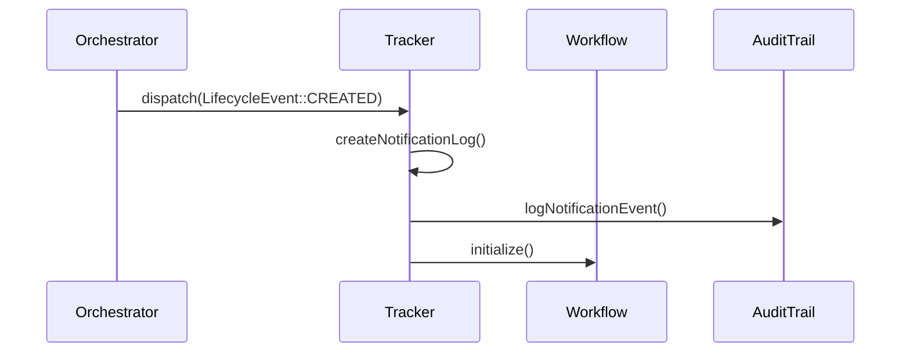

#### State Transition

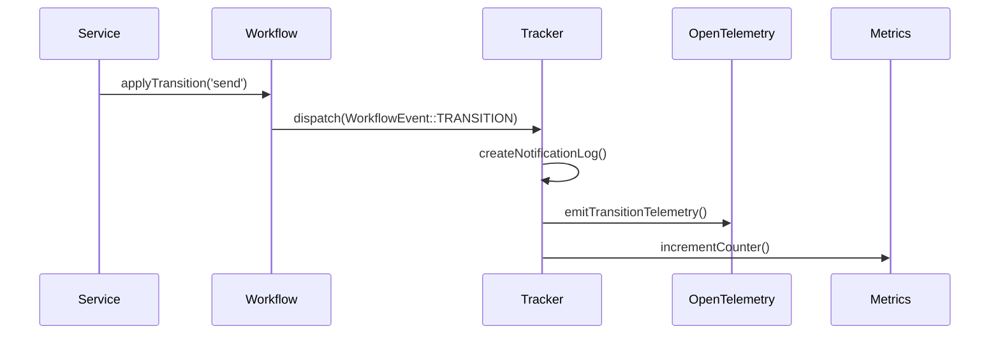

#### Succesful Delivery

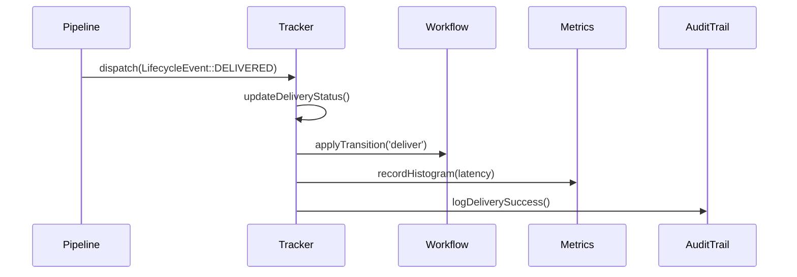

---
### III.2 Key Services  

#### Template Renderer Service  

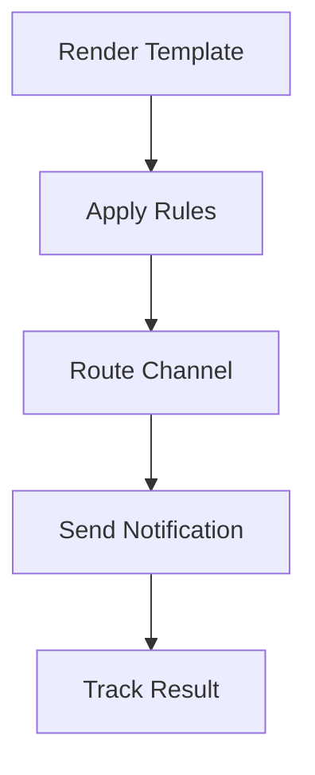

- **Features**:  
  - Supports `{{user.name}}` style placeholders  
  - Automatic XSS sanitization  
  - Redis-cached template compilation  

#### Channel Router Service  

- **Routing logic weights**:  
  | Factor | Weight |  
  |--------|--------|  
  | User Preference | 35% |  
  | Channel Health | 25% |  
  | Message Urgency | 20% |  
  | Cost Constraints | 15% |  
  | Compliance | 5% |  

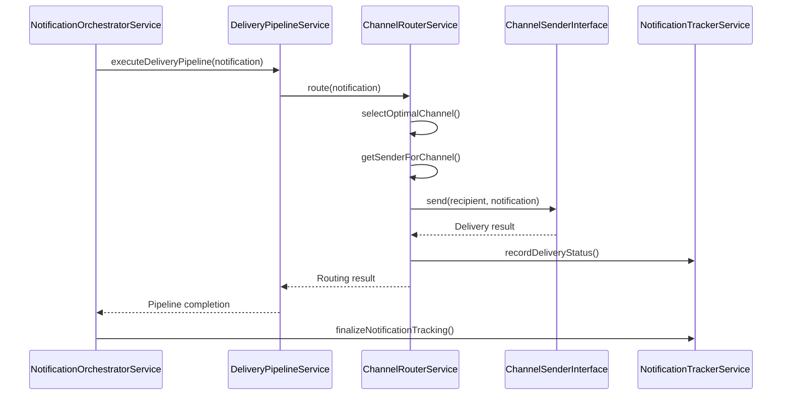

`[DIAGRAM: channel_failover]`  
*Diagram Placeholder: Primary → Secondary → Escalation channel cascade*

#### Delivery Pipeline Service 

Key Features:

1. Pipeline Stages:

    * Pre-processing: Validation and preparation

    * Rule Application: Business logic enforcement

    * Delivery Execution: Channel routing and sending

    * Post-processing: Tracking and event dispatching

2. Error Handling:

    * Domain-specific PipelineProcessingException

    * Contextual logging with full error details

    * Graceful degradation with delivery reports

3. Event-Driven Architecture:

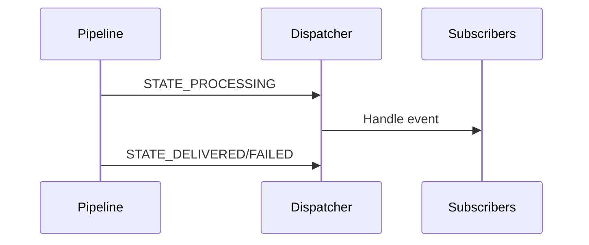

4. Tenant Security:

    * Automatic tenant context validation

    * Inherited from `NotificationSecurityTrait`

4. Reporting:

    * Detailed `DeliveryReport` value object

    * Success/failure tracking

    * Error message capture

***

---
IV. Workflow Types
---------------------------

Workflow Types??

---
### IV.1 Immediate Notifications

---
### IV.2 Scheduled Notifications

---
### IV.3 Event-Triggered Notifications

---
### IV.4 Notification Acknowledgment


## V. Workflow Types  
### V.1 Immediate Notifications  
`[DIAGRAM: immediate_flow]`  
*Diagram Placeholder: Linear flow - API → Orchestrator → HIGH_QUEUE → Pipeline → Delivery*

- **Processing Flow**:  
  1. API request received via `NotificationApiController`  
  2. Orchestrator validates and persists notification  
  3. Message enqueued in HIGH-priority queue  
  4. Pipeline executes within 500ms  
  5. Delivery through primary channel  

- **Performance SLA**:  
  - 95th percentile: < 2 seconds  
  - 99th percentile: < 5 seconds  

- **Use Cases**:  
  - Security alerts (login attempts)  
  - Transaction confirmations  
  - Emergency system notifications  

***

---
V. Multi-Tenant Implementation
-------------------------------

Multitenancy Immplementation???

---
### V.1 Data Isolation Model

Tenant isolation is enforced through:

1.  **Database Layer**:
    
    *   All entities implement TenantAwareInterface
        
    *   Automatic tenant\_id injection in Doctrine queries
        
    *   Unique indexes on (tenant\_id, notification\_id)
        
2.  **Service Layer**:
    
    *   Redis keys prefixed with tenant\_{id}
        
    *   Queue workers tagged with tenant context
        
    *   Tenant-scoped circuit breakers
        
3.  **Hierarchy Support**:
    
    text
    
    Copy
    
    Download
    
    Company (default config)
      ├─ Branch (override config)
      └─ Team (audience segmentation)

`[DIAGRAM: tenant_er_model]`  
*Diagram Placeholder: Entity-Relationship diagram showing Tenant ↔ Notification ↔ ChannelConfig*


---
### V.2 Isolation Mechanisms

#### Enforcement Mechanisms:  
1. **Database Layer**  
   - `TenantAwareInterface` on all entities  
   - Doctrine filter auto-injects `WHERE tenant_id = ?`  
2. **Service Layer**  
   - Redis key prefix: `tenant_{id}_notification`  
   - Tenant-scoped circuit breakers  
3. **Hierarchy Support**  
   ```plaintext
   Company (default config)
     ├─ Branch (override config)
     └─ Team (audience segmentation)

***

---
V. Workflow Types
-----------------

### V.1 Immediate Notifications

*   **Processing Flow**:
    
    1.  API request received via NotificationApiController
        
    2.  Orchestrator validates and persists notification
        
    3.  Message enqueued in HIGH-priority queue
        
    4.  Pipeline executes within 500ms
        
    5.  Delivery through primary channel
        
*   **Performance SLA**:
    
    *   95th percentile: < 2 seconds
        
    *   99th percentile: < 5 seconds
        
*   **Use Cases**:
    
    *   Security alerts (login attempts)
        
    *   Transaction confirmations
        
    *   Emergency system notifications
        

### V.2 Scheduled Notifications

*   **Key Components**:
    
    *   Cron Scheduler: Symfony Command running hourly
        
    *   NotificationFinderService: Locates due notifications
        
    *   Debounce Check: Prevents duplicate deliveries
        
*   **Schedule Patterns**:
    
    Pattern
    
    Syntax Example
    
    One-time
    
    2025-07-15 14:30:00
    
    Recurring
    
    0 8 \* \* MON-FRI (Weekdays at 8 AM)
    
    Relative
    
    +3 days from trigger event
    

### V.3 Event-Triggered Notifications

*   **Integration Points**:
    
    1.  WorkflowModule state transitions
        
    2.  CRM lead status changes
        
    3.  AuditModule compliance violations
        
*   **Sample Subscription**:
    
    php
    
    Copy
    
    Download
    
    class ProjectEventSubscriber implements EventSubscriberInterface {
        public static function getSubscribedEvents(): array {
            return \[
                ProjectCompletedEvent::class \=> 'onProjectCompleted'
            \];
        }
        
        public function onProjectCompleted(ProjectCompletedEvent $event): void {
            $this\->notificationOrchestrator\->trigger(
                'project\_completed',
                $event\->getProject()\->getOwner()
            );
        }
    }
    


### V.2 Scheduled Notifications  
`[DIAGRAM: scheduled_flow]`  
*Diagram Placeholder: Clock icon → Scheduler → BATCH_QUEUE → Pipeline → Delivery*

- **Key Components**:  
  - **Cron Scheduler**: Symfony Command running hourly  
  - **NotificationFinderService**: Locates due notifications  
  - **Debounce Check**: Prevents duplicate deliveries  

- **Schedule Patterns**:  
  | Pattern | Syntax Example |  
  |---------|---------------|  
  | One-time | `2025-07-15 14:30:00` |  
  | Recurring | `0 8 * * MON-FRI` (Weekdays at 8 AM) |  
  | Relative | `+3 days` from trigger event |  

- **Use Cases**:  
  - Daily digest emails  
  - Payment reminders  
  - Certification expiry alerts  

### V.3 Event-Triggered Notifications  
`[DIAGRAM: event_flow]`  
*Diagram Placeholder: Lightning bolt → EventDispatcher → WORKFLOW_QUEUE → Pipeline*

- **Integration Points**:  
  1. WorkflowModule state transitions  
  2. CRM lead status changes  
  3. AuditModule compliance violations  

- **Sample Subscription**:  
  ```php
  class ProjectEventSubscriber implements EventSubscriberInterface {
      public static function getSubscribedEvents(): array {
          return [
              ProjectCompletedEvent::class => 'onProjectCompleted'
          ];
      }
      
      public function onProjectCompleted(ProjectCompletedEvent $event): void {
          $this->notificationOrchestrator->trigger(
              'project_completed',
              $event->getProject()->getOwner()
          );
      }
  }

VI. Error Handling
------------------

### VI.1 Circuit Breaker Pattern

*   **State Management**:
    
    *   Closed State: Normal operations (requests pass through)
        
    *   Open State: Short-circuits requests after threshold breaches
        
    *   Half-Open: Allows trial requests after timeout period
        
*   **Configuration (per channel)**:
    
    \# config/packages/notification.yaml
    circuit\_breaker:
      email:
        failure\_threshold: 5
        reset\_timeout: 600 \# seconds
      sms:
        failure\_threshold: 3
        reset\_timeout: 300
    
```mermaid
stateDiagram-v2
    [*] --> closed
    closed --> open: trip (failures >= threshold)
    open --> half_open: attempt (timeout elapsed)
    half_open --> closed: reset (success)
    half_open --> open: trip (failure)
    open --> closed: reset (manual)
```


## VI. Error Handling  
The Notification Module implements robust error recovery mechanisms to ensure reliable message delivery while maintaining system stability.  

### VI.1 Circuit Breaker Pattern  
`[DIAGRAM: circuit_breaker_states]`  
*Diagram Placeholder: State machine showing Closed → Open → Half-Open transitions*

#### Implementation:  
1. **State Management**:  
   - **Closed State**: Normal operations (requests pass through)  
   - **Open State**: Short-circuits requests after threshold breaches  
   - **Half-Open**: Allows trial requests after timeout period  

2. **Configuration (per channel)**:  
   ```yaml
   notification:
     circuit_breaker:
       email:
         failure_threshold: 5    # Max failures before tripping
         reset_timeout: 600       # Seconds before Half-Open state
         trial_requests: 2        # Test requests in Half-Open state
       sms:
         failure_threshold: 3
         reset_timeout: 300

3. **Monitoring**:
    -  Redis tracks failure counts per tenant-channel combination
    -  Prometheus metric: circuit_breaker_state{channel="email"}
    - 0 = Closed, 1 = Open, 2 = Half-Open

VI.1 Circuit Breaker Pattern

[DIAGRAM: circuit_breaker_states]
Diagram Placeholder: State machine - Closed ↔ Open ↔ Half-Open

    Threshold Configuration:
    yaml

    # config/packages/notification.yaml
    circuit_breaker:
      email:
        failure_threshold: 5
        reset_timeout: 600 # seconds
      sms:
        failure_threshold: 3
        reset_timeout: 300


### VI.2 Retry Mechanism

*   **Exponential Backoff Strategy**:
    
    Attempt
    
    Delay
    
    1
    
    0s (immediate)
    
    2
    
    30s
    
    3
    
    2m
    
    4
    
    10m
    
    5
    
    1h
    
*   **Dead Letter Handling**:
    
    *   After 4 failed attempts:
        
        *   Notification moved to Dead Letter Queue
            
        *   SupportModule ticket created
            
        *   Admin notification sent
            

VI.2 Retry Mechanism
Staged Recovery Strategy:

    Immediate Retry:

        For transient errors (timeouts, rate limits)

        First retry after 10 seconds

    Exponential Backoff:
    Attempt	Delay	Conditions
    1	10s	All errors
    2	1m	Non-critical errors
    3	5m	Non-critical errors
    4	15m	All errors

    Dead Letter Handling:

        After 4 failed attempts:

Retry Mechanism

```mermaid
gantt
    title Exponential Backoff Retry Sequence
    dateFormat  S
    axisFormat %S
    
    section Attempt 1
    Delivery : 0, 1s
    Failure : 1, 1
    
    section Attempt 2
    Retry : after 1s, 2s
    Failure : 3, 1
    
    section Attempt 3
    Retry : after 4s, 4s
    Success : 8, 1
```


```mermaid
graph LR
    Failed --> DLQ[Dead Letter Queue]
    DLQ --> Support[SupportModule Ticket]
    DLQ --> Alert[Admin Notification]
```

VI.2 Retry Mechanism

    Exponential Backoff Strategy:
    Attempt	Delay
    1	0s (immediate)
    2	30s
    3	2m
    4	10m
    5	1h

    Dead Letter Queue:

        Failed notifications after max attempts

        Manual review in SupportModule dashboard


## Failure Recovery System
```mermaid
graph TD
    Failure[Delivery Failure] --> Analyze{Analyze Failure}
    Analyze -->|Transient| Retry[Retry Subscriber]
    Analyze -->|Permanent| Escalate[Escalation Subscriber]
    Analyze -->|Channel Down| Circuit[Circuit Breaker]
    Retry -->|Immediate| Pipeline[Re-enter Pipeline]
    Retry -->|Delayed| Queue[Delayed Queue]
    Escalate --> AltChannel[Alternative Channel]
    Circuit -->|Trip| Disable[Disable Channel]
    Circuit -->|Reset| Monitor[Continue Monitoring]
```

Circuit Breaker Logic
```mermaid
stateDiagram-v2
    [*] --> Closed
    Closed --> Open: Failure threshold exceeded
    Open --> HalfOpen: Reset timeout
    HalfOpen --> Open: Trial failure
    HalfOpen --> Closed: Trial success
```


VI.3 Reconciliation System
Automated Recovery Flow:

    Scheduled Scans:

        Every 30 minutes for PENDING notifications

        Every 24 hours for RECONCILE_REQUIRED state

    Provider Status Checks:

public function reconcile(Notification $notification): void {
    $provider = $this->providerResolver->get($notification->getChannel());
    $status = $provider->getDeliveryStatus($notification->getExternalId());
    
    $this->tracker->updateStatus($notification, $status);
}

    Escalation Path:
    Unresolved Time	Action
    > 1 hour	Retry through secondary channel
    > 24 hours	Create SupportModule ticket
    > 72 hours	Alert system administrators


Reconciliation Process

```mermaid
flowchart TB
    Scheduler[Reconciliation Scheduler] --> Checker[Status Checker]
    Checker -->|Pending| Provider[Query Provider API]
    Checker -->|Expired| Escalate[Create Support Ticket]
    Provider --> Updater[Status Updater]
    Updater --> Tracker[Notification Tracker]
```


VI.4 Alerting Integration
Notification Failure Events:

    CircuitBreakerTrippedEvent:

        Sent to SupportModule when channel disabled

        Includes: Tenant ID, channel, failure count, last error

    NotificationPermanentlyFailedEvent:

        Triggers after dead letter queue placement

        Payload contains:

{
  "notification_id": "uuid",
  "tenant_id": "tenant_123",
  "failure_reasons": ["TIMEOUT", "INVALID_RECIPIENT"],
  "final_delivery_attempt": "2025-07-15T14:30:00Z"
}

ReconciliationRequiredEvent:

    When provider status check fails

    Triggers manual review workflow


VII. Security Model
-------------------

### VII.1 Data Protection

*   **Encryption**:
    
    *   Sensitive payloads encrypted with AES-256-GCM
        
    *   Tenant-specific encryption keys
        
*   **Template Safeguards**:
    
    twig
    
    Copy
    
    Download
    
    {# Automatic sanitization #}
    {{ user\_provided\_content|sanitize\_html }} 
    
    {# Sandboxed execution #}
    
        
    
    

### VII.2 Access Controls

*   **RBAC Matrix**:
    
    Permission
    
    Admin
    
    Manager
    
    User
    
    Send notification
    
    ✓
    
    ✓
    
    △
    
    Configure channels
    
    ✓
    
    △
    
    ✗
    
    View audit logs
    
    ✓
    
    ✓
    
    ✗
    
    △ = Tenant-scoped permissions
    

VII. Security Model
VII.1 Data Protection

    Encryption:

        Sensitive payloads encrypted with AES-256-GCM

        Tenant-specific encryption keys

    Template Safeguards:
    twig

    {# Automatic sanitization #}
    {{ user_provided_content|sanitize_html }} 

    {# Sandboxed execution #}
    
        
    

VII.2 Access Controls

    RBAC Matrix:
    Permission	Admin	Manager	User
    Send notification	✓	✓	△
    Configure channels	✓	△	✗
    View audit logs	✓	✓	✗

    △ = Tenant-scoped permissions


VIII. Monitoring
----------------

### VIII.1 Key Metrics

Metric

Description

Alert Threshold

Queue Depth

Pending messages

\> 1,000

Delivery Latency

Send-to-receive delay

\> 30s

Channel Error Rate

Per-channel failures

\> 5%/5min

Tenant Quota

Monthly allocation usage

\> 90%

Metric	Prometheus Name	Alert Threshold
Queue Depth	notification_queue_messages	> 1,000
Delivery Latency	notification_delivery_latency_seconds	p99 > 30s
Error Rate	notification_error_rate	> 5%/5min
Tenant Quota	tenant_notification_quota_used	> 90%

### VIII.2 Grafana Dashboard

The monitoring dashboard provides:

*   Real-time delivery statistics
    
*   Channel health status indicators
    
*   Tenant usage breakdowns
    
*   Historical performance trends
    
*   Alert notifications for critical thresholds

[DIAGRAM: grafana_dashboard]
Diagram Placeholder: Mock dashboard showing delivery stats, channel health, and tenant usage

    
### VIII.3 Logger

```mermaid
classDiagram
    NotificationTrackerService --> AuditTrailService : logs events
    AuditTrailService --> AuditEvent : persists
    AuditEvent "1" *-- "0..*" AuditChangeSet
    AuditEvent "1" *-- "0..*" AuditTag
    AuditEvent "1" o-- "1" AuditRetentionPolicy
    AuditEvent "1" o-- "0..1" AuditActor
```

```mermaid
graph LR
    A[AuditTrailService] -->|logs| B[Monolog]
    B -->|writes| C[audit.log]
    D[NotificationModule] -->|uses| A
    E[OtherModules] -->|uses| A
```

IX. Integration Guide
---------------------

### IX.1 Sending Notifications

    public function sendPasswordReset(User $user): void {
        $this\->notificationOrchestrator\->createNotification(
            type: 'security',
            recipient: $user\->getEmail(),
            template: 'password\_reset',
            variables: \['token' \=> $this\->generateToken()\],
            tenant: $user\->getTenant()
        );
    }

### IX.2 Adding New Channels

1.  Implement ChannelSenderInterface:
    
    
    class DiscordSender implements ChannelSenderInterface {
        public function send(Recipient $recipient, NotificationContent $content): DeliveryReport {
            // Channel-specific logic
        }
    }
    
2.  Register with tag:
    
        App\\NotificationModule\\Service\\DiscordSender:
        tags: \['notification.channel'\]

IX. Integration Guide
IX.1 Sending Notifications
php

// Sample service integration
public function sendPasswordReset(User $user): void {
    $this->notificationOrchestrator->createNotification(
        type: 'security',
        recipient: $user->getEmail(),
        template: 'password_reset',
        variables: ['token' => $this->generateToken()],
        tenant: $user->getTenant()
    );
}

IX.2 Adding New Channels

    Implement ChannelSenderInterface:
    php

class DiscordSender implements ChannelSenderInterface {
    public function send(Recipient $recipient, NotificationContent $content): DeliveryReport {
        // Channel-specific logic
    }
}

Register with tag:
yaml

    App\NotificationModule\Service\DiscordSender:
        tags: ['notification.channel']


```mermaid
Alerting Integration
sequenceDiagram
    CircuitBreaker->>SupportModule: ChannelDisabledEvent
    SupportModule->>TicketService: createTicket()
    TicketService->>NotificationModule: notifyAdmins()
    NotificationModule-->>SupportModule: TicketCreatedConfirmation
```


X. Appendix
-----------

### X.1 Performance Benchmarks

Scenario

100 Notifications

10,000 Notifications

Email

2.1s

41s

SMS

3.4s

68s

Push

1.8s

35s

_Tested on AWS t3.xlarge with Redis cluster_

### X.2 Troubleshooting Guide

Symptom

Likely Cause

Resolution

Notifications stuck in queue

Worker downtime

Restart messenger consumers

High failure rate

Provider API changes

Update channel adapter

Missing tenant data

Context serialization error

Verify TenantAwareTrait

X. Appendix
X.1 Performance Benchmarks
Scenario	100 Notifications	10,000 Notifications
Email	2.1s	41s
SMS	3.4s	68s
Push	1.8s	35s

Tested on AWS t3.xlarge with Redis cluster
X.2 Troubleshooting Guide
Symptom	Likely Cause	Resolution
Notifications stuck in queue	Worker downtime	Restart messenger consumers
High failure rate	Provider API changes	Update channel adapter
Missing tenant data	Context serialization error	Verify TenantAwareTrait

*© 2025 Autocondat - Notification System v3.1 | Confidential*

***